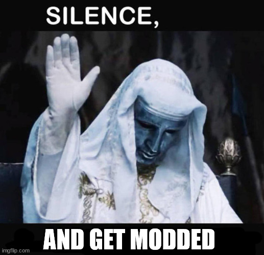

An harmony patch loader to inject using dnSpy or similar means, for Unity games where the developer didn't add modding support. </br>
Once you added these classes and built the module each time you need to add this:

```cs
// add in the Awake/Start/Enable of something that gets executed on startup like a main menu
new GameObject("ModInitializer").AddComponent<ModInitializer>();
```

